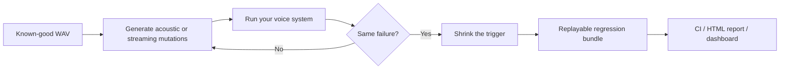

# VoiceShrink

**Delta debugging for voice AI. Find the smallest audio or streaming change that breaks your system, then keep it as a replayable regression test.**

[](https://www.python.org/)
[](LICENSE)
[](https://github.com/AustinYli/voiceshrink/actions/workflows/ci.yml)
[](https://github.com/AustinYli/voiceshrink/releases/tag/v0.2.6)
[](READINESS_REPORT.md)

VoiceShrink starts with a WAV file that your voice system handles correctly. It searches acoustic and streaming mutations, confirms the same failure across repeated trials, minimizes the trigger, and writes a portable evidence bundle with audio, observations, metadata, integrity hashes, and an HTML report.

Use it against an ASR model, voice agent, speech pipeline, or audio API through a Python function, command, or HTTP endpoint. Search and shrinking run locally, and you decide where the target adapter sends audio.



## What developers get

| Capability | Result |
| --- | --- |
| Failure discovery | Searches silence, dropout, noise, gain, clipping, speed, bandwidth, resampling, codec, quantization, packet loss, jitter, delay, and reorder changes |
| Same-failure shrinking | Reduces operations, duration, location, and strength while preserving the original failure fingerprint |
| Real integrations | Tests Python functions, commands, HTTP services, streaming adapters, and optional local faster-whisper models |
| Reproducible artifacts | Saves the clean and minimized audio, scenario, mutation program, observations, metrics, report, and SHA-256 manifest |
| CI regression replay | Emits JSON or JUnit, fails while the bug reproduces, and passes after the target is fixed |
| Investigation mode | Reduces an already-failing recording to a short contiguous reproducing window |

## 30-second local demo

Requires Python 3.10+ and NumPy.

```bash
python -m pip install https://github.com/AustinYli/voiceshrink/releases/download/v0.2.6/voiceshrink-0.2.6-py3-none-any.whl
voiceshrink init demo
voiceshrink baseline demo/demo-scenario.json
voiceshrink discover demo/demo-scenario.json
voiceshrink test --root demo/.voiceshrink/regressions
```

The demo target has a planted bug: an inserted pause of roughly 500 ms changes an order ID. `discover` finds it, shrinks it, and saves `base.wav`, `minimal.wav`, the mutation program, observations, metadata, and an HTML report under `demo/.voiceshrink/regressions/`.

Two additional local demos cover the later roadmap modes:

```bash
voiceshrink init-stream stream-demo
voiceshrink discover stream-demo/stream-scenario.json

voiceshrink init-investigate investigate-demo
voiceshrink investigate investigate-demo/investigate-scenario.json
```

`test` exits nonzero while the saved failure still reproduces. After fixing the target, a resolved case passes. Use `--fresh` after target code or model changes to bypass cached observations.

The generated regression directory is ready to archive or add to a private test fixture store:

```text
.voiceshrink/regressions/<finding>/
├── base.wav
├── minimal.wav
├── mutation.json
├── scenario.json
├── expected.json
├── observed.json
├── metadata.json
├── integrity.json
└── report.html
```

## Connect a voice system

Create a scenario beside a known-good 16-bit PCM WAV file. JSON and simple nested YAML mappings/lists are accepted. Install `voiceshrink[yaml]` for full YAML syntax.

```yaml
name: order-number
audio: fixtures/order_74821.wav
expected:
  tool:
    name: lookup_order
  arguments:
    order_id: "74821"
target:
  type: command
  command: [python, my_agent_test.py, "{audio}"]
  timeout: 60
  fingerprint: my-agent-v1
oracle:
  equivalence: same_category
search:
  max_runs: 200
  max_concurrency: 4
  max_failures: 3
  cost_per_run: 0.002
  cost_currency: USD
  families: [silence, dropout, noise, gain, clipping, speed, bandwidth, resample, codec, quantize]
evaluation:
  baseline_trials: 3
  trials: 3
  failure_threshold: 1.0
```

The command receives the candidate WAV path and prints one JSON value to stdout, for example:

```json
{"tool":"lookup_order","arguments":{"order_id":"74821"}}
```

The target may also print `{"final_output": ..., "stages": [{"name": "asr", "output": ...}]}` to enable earliest observed stage divergence in the report. The `expected` mapping checks named fields and tolerates extra fields in the target output. `expected.transcript_contains` tests a substring. `expected.equals` compares a complete output value.

### Intervention-capable targets

If the system can replace a stage output while keeping the failing audio and downstream pipeline fixed, VoiceShrink runs one intervention after shrinking. It replaces the earliest divergent stage with its known-good output and records whether this restores the expected behavior.

- Python: add `intervention_callable: "my_module:intervene"`. It receives `(audio_path, scenario, stage_name, known_good_output)`.
- Command: add `intervention_command`. It receives `{"stage": ..., "replacement": ...}` on standard input and prints a target result as JSON.
- HTTP: add `intervention_url`. It receives JSON containing `audio_base64`, `stage`, and `replacement`.

This is stronger evidence that the observed stage divergence materially contributes to the failure. The report still avoids claiming a definitive root cause.

### Streaming transport faults

Streaming targets receive deterministic PCM chunk plans. Acoustic mutations are rendered first; transport mutations then change chunk delivery without rewriting the WAV. Supported transport families are `packet_loss`, `jitter`, `chunk_delay`, and `reorder`.

```yaml
target:
  type: python
  callable: my_target:run_file
  stream_callable: my_target:run_stream
streaming:
  enabled: true
  chunk_ms: 20
search:
  families: [packet_loss, jitter, chunk_delay, reorder]
```

The Python stream function receives `(stream_plan, scenario)`. `stream_plan.chunks` contains sequence numbers, original timestamps, delivery timestamps, drop state, and base64 encoded 16-bit PCM. `stream_plan.delivered` returns non-dropped chunks in simulated delivery order.

- Command targets use `stream_command`; the complete stream plan arrives as JSON on standard input.
- HTTP targets use `stream_url`; the complete stream plan is POSTed as JSON.

Saved streaming regressions include `stream-plan.json` and a transport summary. The simulator describes delivery; the target adapter decides whether to replay the timing in real time or feed it into a virtual clock.

### Other adapters

- **Python:** `target: {type: python, callable: "my_module:run"}`. The function receives `(audio_path, scenario)` and returns a `TargetResult`, a structured result, or the final output directly. Scenario-local modules can be imported without installing them. Subclass `voiceshrink.Target` for a reusable adapter.
- **HTTP:** `target: {type: http, url: "http://localhost:8000/test-voice"}`. VoiceShrink POSTs raw WAV bytes with `Content-Type: audio/wav` and expects JSON back.
- **Command:** Use a list of arguments when possible; a command string is also accepted. `{audio}` is replaced with the absolute path to the rendered candidate.

Keep credentials out of scenario files by referencing environment variables:

```yaml
target:
  type: http
  url: https://staging.example.test/voice
  headers_env:
    Authorization: VOICE_TEST_AUTHORIZATION
```

Command targets support `environment_from`, which maps a child-process variable to a host variable, plus `environment` for non-secret literal values.

### Optional local ASR reference

Install the optional adapter and point a scenario at a local faster-whisper model:

```bash
python -m pip install -e ".[asr]"
```

```yaml
expected:
  transcript_contains: "seven four eight two one"
target:
  type: faster-whisper
  model: tiny.en
  device: cpu
  compute_type: int8
  language: en
  fingerprint: faster-whisper-tiny-en
```

The first execution may download the selected model. The ASR adapter is optional and is never imported by core VoiceShrink workflows.

The repository includes a completed real-model scenario under `real-asr-demo/`. With faster-whisper installed, run it with:

```bash
voiceshrink baseline real-asr-demo/jfk-scenario.json
voiceshrink discover real-asr-demo/jfk-scenario.json
voiceshrink test --root real-asr-demo/.voiceshrink/regressions
```

Using `tiny.en` on CPU, VoiceShrink found a deterministic transcript failure caused by 29 dB SNR background noise. The clean transcript contains “ask not what your country can do for you”; the minimized candidate produces “asked not what your country can do for you.” The saved regression reproduces offline once the model has been cached.

Use a staging target, dry-run tool calls, or mocks for anything that could book, delete, transfer, email, or otherwise change the world. A discovery run may call the target many times.

## Failure matching and limits

The clean input must pass all baseline trials. A candidate is considered failing when the fraction of trials with the **same failure** meets `evaluation.failure_threshold`. `oracle.equivalence` can be `same_category` (default; same component, category, and field path), `exact` (same observed value), or `custom` with `oracle.callable: "module:function"` accepting two `FailureFingerprint` objects.

Search tests single mutations at several strengths, then at more audio locations, then bounded pairs. Shrinking removes operators, reduces affected regions, and probes weaker strengths. It does not assume failures are monotonic. `search.max_runs` limits actual target executions across baseline, discovery, and shrinking; cached evaluations do not spend that budget. The report describes the **smallest observed reproducing mutation under the configured search budget**, not a proven global minimum.

Temporal search combines fixed beginning, middle, and end positions with deterministic energy-based speech/quiet transitions and quiet-gap midpoints detected from the clean input. Boundary positions are capped to keep execution budgets predictable.

Pairwise search is enabled by `search.max_pairs`. Higher-order interaction search is opt-in because it can consume many target calls:

```yaml
search:
  max_combinations: 40
  combination_size: 3
  seed: 10999
```

Enabled higher-order programs use distinct mutation families and bounded seeded sampling. The same scenario and seed generate the same candidate order.

`search.max_failures` lets one run continue after its first finding. Failures are considered distinct using the configured oracle equivalence mode; every distinct failure receives its own minimized regression bundle.

The persistent SQLite cache is keyed by the base audio, mutation program, target configuration, expected behavior, oracle, and trial count. Set a `target.fingerprint` when model/prompt/configuration versions change, or use `--fresh`.

Repeated trials use up to `search.max_concurrency` workers. Leave it at `1` for Python targets that are not thread safe.

Command adapters enforce `target.timeout` for file, streaming, and intervention calls and report a clear timeout error. Invalid or corrupt WAV inputs are rejected with a consistent validation error before discovery begins.

### Report privacy

Local regression files retain the detailed outputs needed for replay. Generated HTML can hide sensitive values and audio controls:

```yaml
privacy:
  redact_report_outputs: true
  hide_report_audio: true
  cache_results: false
```

The first two settings affect the HTML report. The JSON observations and WAV files remain in the local artifact bundle. Set `cache_results: false` when even local SQLite persistence of intermediate target outputs is undesirable; this increases target calls on repeated searches.

## Investigate an existing failure

Investigate mode accepts audio that already fails the scenario expectation and searches for a short contiguous window with the same failure fingerprint:

```yaml
name: failed-customer-call
audio: failed-call.wav
expected:
  transcript_contains: "74821"
target:
  type: command
  command: [python, my_agent_test.py, "{audio}"]
search:
  max_runs: 200
investigate:
  min_window_ms: 250
  boundary_step_ms: 10
```

```bash
voiceshrink investigate failed-scenario.yaml
```

The bundle under `.voiceshrink/investigations/` contains the original and reduced WAV files, the crop program, target observations, metadata, and an HTML report. Because this mode has no known-good reference, the result is described as the smallest observed contiguous failing window. It is reproduction evidence and does not prove that discarded audio was semantically irrelevant or that the retained window is a root cause.

## CLI

```text
voiceshrink init [directory]
voiceshrink init-stream [directory]
voiceshrink init-investigate [directory]
voiceshrink baseline scenario.yaml [--fresh]
voiceshrink discover scenario.yaml [--fresh]
voiceshrink investigate scenario.yaml [--fresh]
voiceshrink validate scenario.yaml [--json]
voiceshrink test [--root path] [--fresh]
voiceshrink report issue-name [--root path]
voiceshrink verify path/to/artifact [--json]
voiceshrink dashboard [--root .voiceshrink]
voiceshrink doctor [--scenario scenario.yaml] [--json]
```

`discover` and `investigate` also accept `--json` and emit one machine-readable result for CI or scripting. `validate` checks configuration, audio format, mutation families, and streaming adapter availability without calling the target.

Scenario validation runs before engine construction or target execution. It rejects invalid target requirements, URLs, budgets, concurrency, costs, mutation families, thresholds, streaming and investigation settings, oracle modes, and privacy value types. Use `voiceshrink --version` when recording diagnostics.

Every new regression and investigation bundle includes `integrity.json` with SHA-256 hashes and file sizes. `verify` detects missing or changed files. `dashboard` generates `index.html` and `dashboard.json` with links, mutation programs, reproduction rates, and integrity status for all bundles under one `.voiceshrink` directory.

Integrity manifests detect accidental or unexpected local changes. They are stored beside the artifacts and are not cryptographic signatures. Only replay bundles and target configurations from trusted sources, because `voiceshrink test` executes the target named by each saved scenario.

For CI, `test` accepts `--json` and `--junit results.xml`. A still-reproducing regression is written as a JUnit failure and makes the command exit nonzero. A regression that no longer reproduces is reported as resolved. `doctor` checks Python, NumPy, optional YAML/ASR integrations, workspace access, and an optional scenario without executing its target.

Set `search.cost_per_run` when a target has a known per-call price. Artifacts record the estimated target cost, configured currency, wall-clock search duration, execution count, and cached observations.

## Scope

The implemented project now includes Discover mode, bounded Investigate mode, local PCM WAV mutations, simulated streaming transport faults, Python/command/HTTP adapters, structured output checks, concurrent repeated trials, caching, three-phase shrinking, regression replay, stage traces, optional interventions, an optional faster-whisper reference adapter, and static HTML reports. The `codec` family simulates an 8-bit μ-law roundtrip; it does not invoke an external encoder. Without a successful intervention, traces support only the narrower claim **earliest observed divergence**.

Run the tests with `python -m unittest discover -s tests -v`.

## Project status

VoiceShrink v0.2.6 is a tested developer release. The local release audit covers clean installation, all three operating workflows, Python/command/HTTP targets, source and wheel equivalence, integrity checks, and real faster-whisper regression replay. See [READINESS_REPORT.md](READINESS_REPORT.md) for the evidence and current boundaries.

The implementation-to-plan mapping is in [PLAN_AUDIT.md](PLAN_AUDIT.md), completed milestones are in [ROADMAP.md](ROADMAP.md), and release changes are in [CHANGELOG.md](CHANGELOG.md).

## Contributing

Bug reports, target adapters, new deterministic mutation families, documentation improvements, and focused pull requests are welcome. Read [CONTRIBUTING.md](CONTRIBUTING.md) before opening a change. Security issues should follow [SECURITY.md](SECURITY.md).

VoiceShrink is available under the [MIT License](LICENSE).

## Local release package

Validated source and wheel packages are available under `release/`. The source archive includes the README, changelog, roadmap, package code, and test suite. `release/SHA256SUMS.txt` records checksums for transfer verification, and `release/README.md` contains installation and validation commands.
